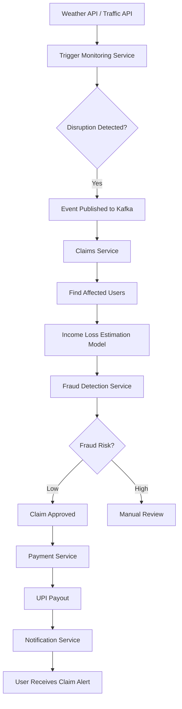
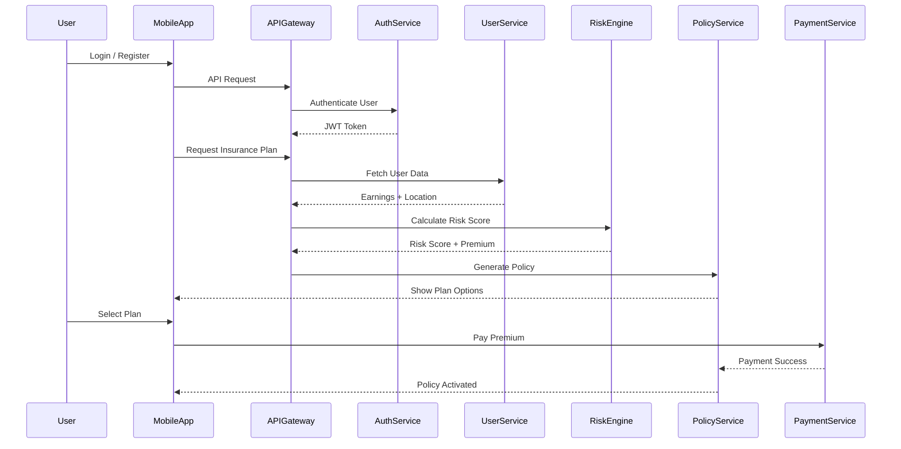
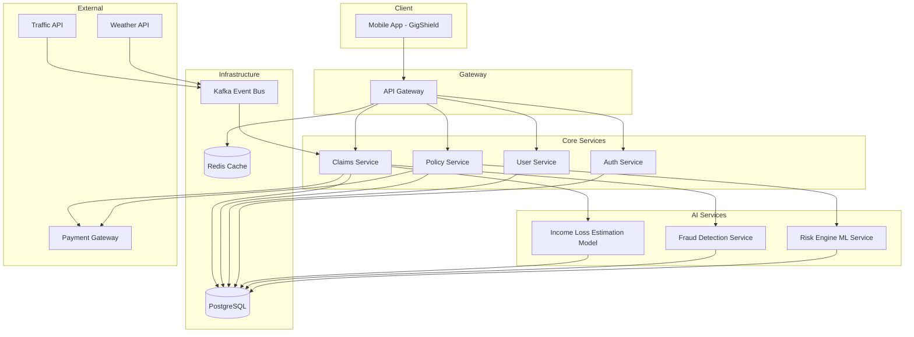
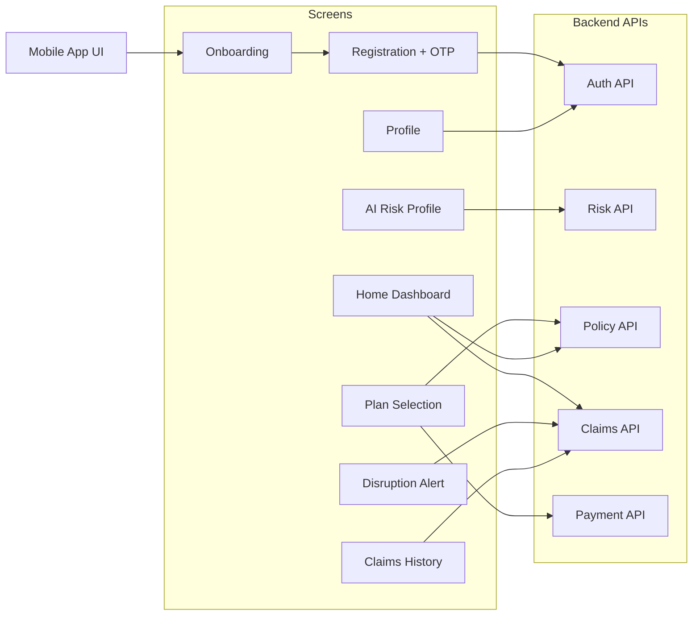

# GigShield

## Problem Statement

Gig delivery workers in India depend on **daily or weekly earnings** to sustain their livelihood. However, their ability to work is often disrupted by **external factors** such as:

- Heavy rainfall
- Flooding
- Extreme heat
- Curfews or strikes
- Market shutdowns

When these disruptions occur, workers **lose income even though the loss is not their fault**.

### Limitations of Traditional Insurance

Traditional insurance products:

- Are claim-based
- Require manual documentation
- Have slow claim processing

Gig workers need a **simple, fast, and automated income protection system**.

**GigShield** solves this problem using **AI-powered parametric insurance** that automatically triggers payouts when disruption conditions are met.

---

## Primary Persona

### Rahul — Delivery Partner

| Field | Detail |
|---|---|
| Name | Rahul Kumar |
| Age | 27 |
| Occupation | Swiggy/Zomato Delivery Partner |
| Location | Mumbai |
| Vehicle | Two-wheeler |

### Income Pattern

- Average weekly earnings: ₹6,000 – ₹9,000
- Paid per delivery
- Peak earnings during lunch and dinner hours

### Pain Points

- Heavy rain reduces deliveries
- Flooded roads make travel unsafe
- Extreme heat limits working hours
- Curfews or strikes stop work completely

---

## Persona-Based Scenarios

### Scenario 1 — Heavy Rainfall

#### Situation

- Rahul plans to work 6 hours in the evening
- Mumbai receives **heavy rainfall (70mm+)**
- Many areas become flooded
- Deliveries drop drastically

#### Impact

Instead of earning ₹1,200, Rahul earns only ₹300.

#### GigShield's Response

1. Weather API detects rainfall above the threshold
2. System checks Rahul's location
3. Policy conditions are satisfied
4. Parametric claim is automatically triggered
5. Rahul receives ₹800 payout instantly via UPI

**Result:** Rahul's weekly income remains stable.

---

### Scenario 2 — Extreme Heat

#### Situation

- Temperature reaches **45°C**
- Delivery platforms warn partners to limit outdoor exposure
- Rahul works only 3 hours instead of 6

#### Impact

Loss of daily income.

#### GigShield's Response

1. Temperature API detects extreme heat threshold breach
2. AI risk model validates disruption severity
3. System checks Rahul's active policy
4. Automatic claim payout is issued

---

### Scenario 3 — City Curfew / Strike

#### Situation

- A local protest causes curfew restrictions
- Food delivery services temporarily suspend operations

#### Impact

Rahul cannot work for the entire day.

#### GigShield's Response

1. News/disruption API detects curfew event
2. System matches Rahul's registered city
3. Policy trigger is activated
4. Instant compensation is sent

---

## Application Workflow

### Registration

The system must allow gig workers to register using:

- Name
- Phone Number
- City
- Delivery platform
- Weekly income

A user profile is created upon successful registration.

---

### AI Risk Assessment

The system must:

- Analyze location-based risk factors:
  - Weather history
  - Flood frequency
  - Heatwaves
  - Curfew/Strike frequency
- Calculate a risk score
- Recommend an appropriate weekly insurance plan

#### Example

| Risk Level | Weekly Premium |
|---|---|
| Low | ₹40 |
| Medium | ₹60 |
| High | ₹80 |

---

### Plan Recommendation

The system recommends weekly coverage plans.

#### Example

| Plan | Weekly Premium | Coverage |
|---|---|---|
| Plan A | ₹60/week | Up to ₹2,000 |
| Plan B | ₹80/week | Up to ₹3,000 |

User selects a plan.

---

### Policy Activation

User must be able to:

- View recommended plans
- Select weekly coverage
- Activate policy using:
  - UPI
  - Wallet (simulated)

Policy becomes active for 7 days.

---

### Real-Time Distributed Monitoring

The platform continuously monitors:

- Rainfall
- Temperature
- Flood alerts
- Curfew or strikes

Using external APIs.

---

### Automated Claim Trigger

When disruption thresholds are met:

1. System detects event
2. Checks affected location
3. Validates active policies
4. Automatically creates a claim

No manual claim submission is required.

#### Auto Claim Workflow

---

### Fraud Detection

The system verifies:

- User GPS location
- Delivery activity data (simulated)
- Duplicate claims

Fraud prevention includes:

- Location mismatch detection
- Multiple claims filtering
- Policy validity checks

---

### Instant Payout

Once a claim is validated:

- System initiates payout
- Money is transferred via:
  - UPI
  - Simulated payment gateway

User receives a confirmation notification.

---

## Weekly Premium Model & Parametric Triggers

| Risk Level | Weekly Premium | Coverage |
|---|---|---|
| Low | ₹40 | Up to ₹1,500 |
| Medium | ₹60 | Up to ₹2,000 |
| High | ₹80 | Up to ₹3,000 |

Parametric triggers are pre-defined thresholds tied to external data sources. When a threshold is crossed (e.g., rainfall > 70mm, temperature > 44°C, curfew detected), the system automatically initiates a claim — no worker action needed.

---

## AI/ML Integration Workflow

GigShield uses 3 core machine learning models built with:

- Pandas  
- NumPy  
- Scikit-learn  
- XGBoost  

---

### 1. Risk Prediction Model (Premium Calculation)

Calculates how risky a worker's specific area is before they purchase a policy.

**Input:**
- Rainfall history
- Flood risk
- Historical traffic congestion
- AQI

**Output:**
- Risk Score (e.g., `0.72`)
- Dynamic risk factor added to the base premium
- Real-time premium adjustment for hyperlocal risk zones

#### Premium Purchase Flow (Risk Based)

---

### 2. Income Loss Estimation Model

Once a parametric trigger activates, this model calculates how much income the worker lost due to disruption.

**Workflow:**

- Tracks normal delivery efficiency vs disrupted efficiency
- Example:
  - Normal: 3 deliveries/hour × ₹40
  - Disrupted: 1 delivery/hour
- Calculates the exact income lost during disruption periods
- Issues proportionate payouts

Additionally uses routing APIs (e.g., TomTom) to detect:

- Drop in delivery distance
- Route time inefficiency
- Reduction in deliveries per hour

---

### 3. Fraud Detection Model

Protects the insurance engine from false claims using anomaly detection.

**Techniques:** Isolation Forest, One-Class SVM

**Workflow:**

- Scans for suspicious activities before approving claims
- Detects:
  - GPS mismatches (e.g., worker in Pune but event in Mumbai)
  - Duplicate claim attempts
  - Unusual claim patterns
- Prevents fraudulent payouts through:
  - Location validation
  - Pattern anomaly detection
  - Policy consistency checks

---

## Tech Stack

| Layer | Technology |
|---|---|
| Mobile Frontend | Java (Android) |
| Backend | Node.js + TypeScript |
| Database | PostgreSQL + NeonDB + Prisma ORM |
| AI / ML | Python (Pandas, NumPy, Scikit-learn, XGBoost) |
| Payments | UPI / Simulated Payment Gateway |

---
## External Integrations & APIs

GigShield relies on real-time external data sources to power its parametric insurance engine and AI models.

| Category | Service | Purpose |
|---|---|---|
| Weather Data | OpenWeather | Rainfall, temperature, storm alerts |
| Air Quality | AQICN (World Air Quality Index) | AQI-based disruption detection |
| Historical Weather | IMD (Mausam) | Model training (rainfall, heat patterns) |
| Traffic Intelligence | TomTom | Congestion, road closures, delays |
| Maps & Visualization | TomTom Maps | Worker location & risk zones |
| Payments | Razorpay | Premium payment & payout simulation |
| Notifications | Twilio | SMS alerts & claim notifications |

---

## Role of TomTom (Traffic Intelligence Layer)

TomTom acts as a **road intelligence provider** enabling hyperlocal decision-making.

### 1. Worker Location & Zone Detection
- Maps worker GPS to delivery zones  
- Enables zone-based risk scoring  

**Example:**
- Location: 19.0760, 72.8777  
- Zone: Andheri East  
- Flood Risk: High  
- Risk Level: Medium  

---

### 2️. Traffic Disruption Detection
- Detects congestion, accidents, and blocked roads  

**Example:**
- Congestion Index: 8.7 (Normal: 3)  
→ Delivery disruption detected  

---

### 3️. Route Delay Analysis
- Compares normal vs disrupted travel time  

**Example:**
- Normal: 12 min  
- Disrupted: 35 min  
→ Delivery efficiency drop  

---

### 4️. Hyperlocal Risk Zones
- Custom zones:
  - Flood-prone areas  
  - Pollution-heavy zones  
  - Traffic choke points  

→ Used for dynamic premium pricing  

---

### 5️. Delivery Activity Estimation
- Estimates deliveries/hour and route efficiency  

**Example:**
- Normal: 5 deliveries/hour  
- Disrupted: 2 deliveries/hour  
→ Income loss detected  

---

### 6️. Heatmaps for Dashboard
- Visualizes:
  - Flood zones (Red)  
  - Traffic disruptions (Orange)  
  - Normal zones (Green)  

---

## Architecture

### High-Level Architecture

### Frontend → Backend Interaction

---

## Why Mobile-First

Mobile apps consistently outperform websites in engagement, performance, and user retention.

### Key Advantages

- Push notifications drive real-time engagement — unlike websites, apps reach users directly on their lock screen
- Native device access (GPS, camera, biometrics) enables richer, context-aware features that websites can't match
- Installed presence on a user's home screen reduces friction and builds habitual use
- Partial offline functionality ensures continuity even with poor connectivity
- Deeper personalization through device behaviour leads to higher satisfaction and retention

### Mobile App vs. Website — At a Glance

| Factor | Mobile App | Website |
|---|---|---|
| Push Notifications | Direct, timely alerts to users | Email or browser only |
| Device Integration | GPS, camera, biometrics, sensors | Limited hardware access |
| Performance | Native speed, smooth interactions | Browser-dependent latency |
| Offline Access | Works without internet (partially) | Requires constant connectivity |
| User Retention | Always visible on home screen | Users must seek it out |
| Personalization | Deep behavior & device data | Limited customization |

### Bottom Line

A mobile app gives direct access to users, richer device capabilities, and a persistent presence on their devices. For a platform that depends on real-time alerts and engagement, it is the stronger long-term investment.

---

## Adversarial Defense & Anti-Spoofing Strategy

We implement a multi-layer, signal-based verification system to detect and prevent GPS spoofing and coordinated fraud attacks while ensuring fairness for genuine workers.

---

## 1. Differentiation: Real vs Fake Worker

We differentiate between a genuine worker and a fraudster by validating consistency across multiple signals.

A real worker shows:
- Continuous movement along real roads  
- Realistic speed and route patterns  
- Natural drop in deliveries during disruptions  

A fraudster shows:
- Unrealistic GPS jumps  
- Static or straight-line movement  
- No correlation between movement and delivery activity  

Key idea:  
A genuine disruption affects movement, traffic, and delivery activity together, whereas spoofing typically affects only GPS.

---

## 2. Data Used Beyond GPS

We use multiple independent data points to detect fraud:

- Movement data (distance traveled, speed patterns)  
- Route validation (road network matching via TomTom)  
- Delivery activity (deliveries per hour, active time)  
- Traffic congestion (real-world slowdown)  
- Weather conditions (rainfall, temperature, alerts)  
- Historical behavior (usual work zone and patterns)  
- Claim patterns (frequency, timing, clustering)  

Fraud is detected when these signals do not align.

---

## 3. UX Balance: Protecting Honest Workers

We ensure genuine workers are not penalized by using risk-based handling:

- Low-risk claims → instant payout  
- Medium-risk → additional automated verification  
- High-risk → manual review  

Additional safeguards:
- No rejection based on a single signal  
- Multi-signal validation before blocking  
- Partial payouts in uncertain cases  

Our goal is to maintain trust while preventing fraud.

---

## Threat Model

We assume attackers may:
- Fake GPS location to appear in high-risk zones  
- Trigger false claims during disruptions  
- Coordinate across multiple accounts (fraud ring)  
- Exploit automated payout systems  

---

## Multi-Layer Fraud Defense System

Instead of relying on a single check such as GPS, we use layered verification.

---

### GPS Spoofing Detection

We do not trust raw GPS blindly.

Techniques used:
- Speed consistency check to detect unrealistic jumps  
- Route validation using TomTom to ensure movement follows real roads  
- Drift pattern analysis to identify unnatural movement behavior  
- Device integrity signals (optional) to detect emulators or rooted devices  

---

### Delivery Activity Verification

Fraudsters can fake location, but not real work patterns.

We validate:
- Deliveries per hour  
- Route movement  
- Distance traveled  

Example:
A user claims to be active for 6 hours but shows minimal movement → flagged as suspicious  

---

### Cross-Signal Validation

A disruption must be confirmed across multiple signals:

| Signal | Expected |
|---|---|
| Weather | Heavy rain or extreme heat |
| Traffic | High congestion |
| Delivery Activity | Drop in deliveries |

If only one signal is triggered, no payout is issued.

---

### Fraud Ring Detection

We detect coordinated attacks across multiple users.

Indicators:
- Identical GPS patterns  
- Same timestamps  
- Similar movement behavior  

Method:
- Cluster analysis  
- Group anomaly detection using Isolation Forest  

Suspicious clusters are flagged for review.

---

### Location Consistency Check

We verify:
- Registered city versus claim location  
- Historical movement patterns  

Example:
A user who usually operates in Mumbai suddenly claims in another city → flagged as suspicious  

---

### Policy Abuse Protection

- One claim per event per user  
- Cooldown between claims  
- Policy must be active before the disruption  

---

### Risk-Based Claim Approval

| Risk Level | Action |
|---|---|
| Low Risk | Instant payout |
| Medium Risk | Additional automated checks |
| High Risk | Manual review |

---

## AI-Powered Fraud Detection

We use anomaly detection models:
- Isolation Forest  
- One-Class SVM  

Features include:
- GPS consistency  
- Movement patterns  
- Claim frequency  
- Zone mismatch  
- Group behavior  

---

## Final Defense Philosophy

We trust signals, not user claims.

- No reliance on a single data source  
- Multi-layer validation  
- Hybrid AI and rule-based approach  

---

GigShield remains secure, scalable, and reliable under adversarial conditions.
